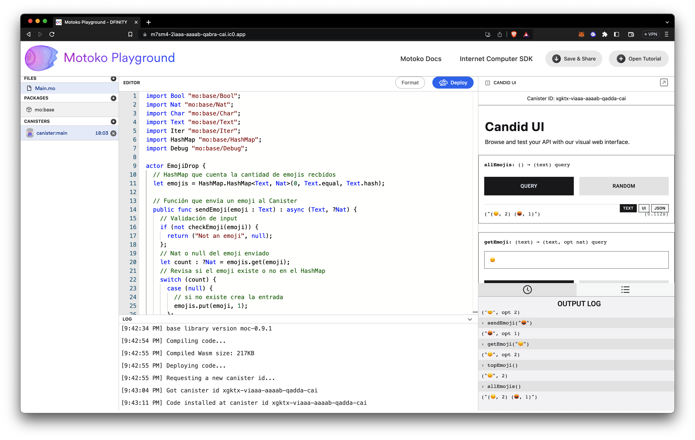
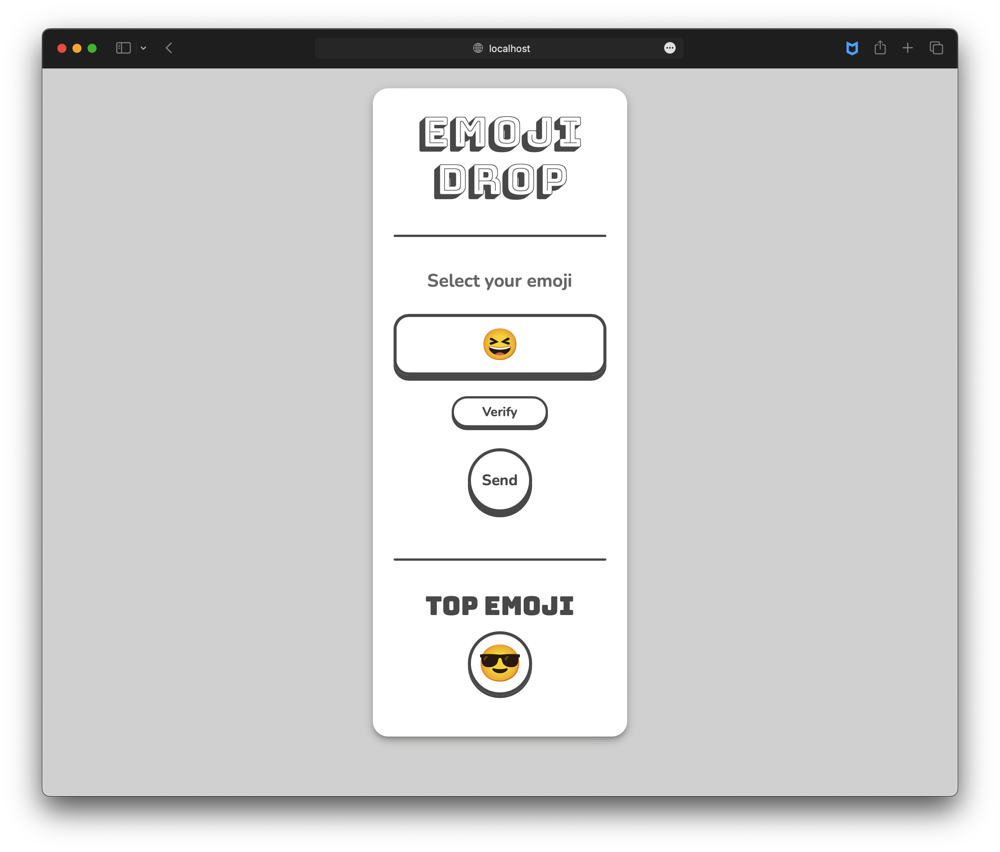

# EmojiDrop

DApp que permite regalar emojis a un Canister en Internet Computer.

## Archivos

-   **_Canister_** -> [`src/emoji_drop_backend/main.mo`](./src/emoji_drop_backend/main.mo)
-   **_Frontend_** -> [`/src/emoji_drop_frontend`](./src/emoji_drop_frontend/)

## Estructura del canister

-   `emojis` -> `HashMap` que incluye todos los emojis recibidos y el número de veces que se han recibido.
-   `sendEmoji(emoji)` -> Función que envía o actualiza un nuevo emoji (incrementa el conteo).
-   `getEmoji(emoji)` -> Revisa si el emoji se encuentra en la lista de regalos.
-   `topEmoji()` -> Muestra el emoji más popular y el número de veces que se ha recibido.
-   `allEmojis()` -> Muestra todos los emojis recibidos en el canister
-   `checkEmoji(emoji)` -> Función interna que revisa que los _inputs_ del usuario sean en verdad emojis.

## Probar el canister

-   Asegurarse de tener una terminal `UNIX` y tener instalado el `SDK`

    ```Shell
    sh -ci "$(curl -fsSL https://internetcomputer.org/install.sh)"
    ```

-   Comenzar un entorno local de ejecución
    ```Shell
    # Verifica estar en el directorio de este proyecto
    dfx start
    ```
-   Despliega el canister
    ```Shell
    dfx deploy
    ```
    -   Retorna la `URL` de la **Candid UI**
        ```Shell
        ...
        URLs:
        Backend canister via Candid interface:
            emoji_drop_backend: http://127.0.0.1:4943/?canisterId=be2us-64aaa-aaaaa-qaabq-cai&id=bkyz2-fmaaa-aaaaa-qaaaq-cai
        ```
-   Juega con el canister

    ```Shell
    # Enviar emojis
    dfx canister call emoji_drop_backend sendEmoji 🙂
    # ("🙂", opt (1 : nat))
    dfx canister call emoji_drop_backend sendEmoji 🙂
    # ("🙂", opt (2 : nat))
    dfx canister call emoji_drop_backend sendEmoji 🤬
    # ("🤬", opt (1 : nat))

    # Buscar emoji
    dfx canister call emoji_drop_backend getEmoji 🙂
    # ("🙂", opt (2 : nat))

    # Buscar el emoji más popular
    dfx canister call emoji_drop_backend topEmoji
    # ("😀", 2 : nat)

    # Mostrar todos los emojis
    dfx canister call emoji_drop_backend allEmojis
    # ("(🙂, 2) (🤬, 1) ")
    ```

-   Alternativamente se puede jugar a través de la **Candid UI**
    

-   O en el _[**playground**](https://m7sm4-2iaaa-aaaab-qabra-cai.ic0.app/)_
    

## Frontend

-   Creado con [Vite](https://vitejs.dev)
-   Cumple con las siguientes funciones
    -   Selección el emoji que se quiere regalar al canister
    -   Verificación de identidad con Internet Identity para evitar _spam_ y sobregasto de _cycles_
    -   _Call to Action_ que ejecuta la función `sendEmoji()` del canister backend
    -   Muestra el Emoji más popular obtenido del query `topEmoji()`

## Fullstack:

-   Para correr la DApp localmente hay que seguir los siguientes pasos:
    -   Iniciar una terminal en el directorio raíz
    -   Iniciar una réplica local `npm start --clean`
    -   En una nueva terminal generar el ambiente de desarrollo y desplegar los canisters con `npm run setup`
    -   Se generará el directorio `src/declarations/emoji_drop_backend` que contendrá los elementos para interactuar con el backend, así como el archivo `.did`
        ```DID
        service : {
            allEmojis: () -> (text) query;
            getEmoji: (text) -> (text, opt nat) query;
            sendEmoji: (text) -> (text, opt nat);
            topEmoji: () -> (text, nat) query;
        }
        ```
    -   Ir a las direcciones que se muestran en terminal
        ```SHELL
        Deployed canisters.
        URLs:
        Frontend canister via browser
            emoji_drop_frontend: http://127.0.0.1:4943/?canisterId=bd3sg-teaaa-aaaaa-qaaba-cai
        Backend canister via Candid interface:
            emoji_drop_backend: http://127.0.0.1:4943/?canisterId=be2us-64aaa-aaaaa-qaabq-cai&id=bkyz2-fmaaa-aaaaa-qaaaq-cai
        ```
    -   Y ahora se puede interactuar con ambos canisters

## Planes a futuro

-   [ ] Explorar a fondo la manera de validar los emojis utilizando los códigos de `Unicode`


